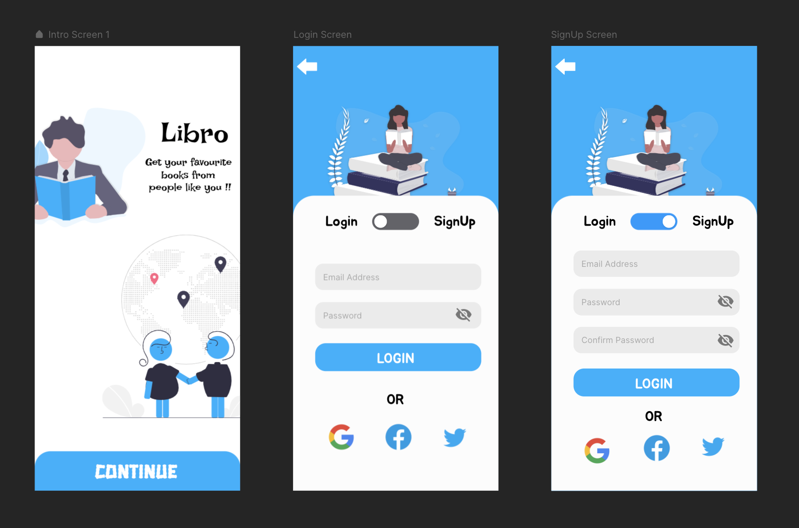

# Book-Donation-App
An App Built using flutter using which we can share books with people around us !!

# Tech Stack
   

## Contributing 
Please read [CONTRIBUTING.md](https://github.com/infiniteoverflow/Libro/blob/main/Contributing.md) for information on how to contribute to the project.

To follow our sprints and workflow install [zenhub extension](https://www.zenhub.com/extension) to access our board.

**You can access the google-services.json file from here :** https://drive.google.com/file/d/1xLvwVTZQ3EWYl1uBna2IPp46hsjBQ8ul/view?usp=sharing

## Tentative UI Design

**This project is a part of Girlscript Summer of Code 21'**

